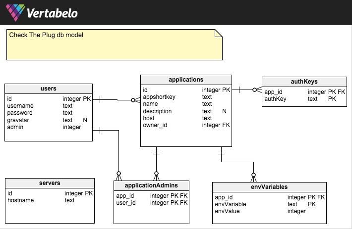

Check the plug
==============

### Description
A simple bottle.py utility for serving and managing configs for docker based projects.

### Installation

#### Requirements
* Python (built using 3.4)
* virtualenv (Optional)
* sqlite (optional)

#### Steps
1. Unpack anywhere
2. Modify settings.json to meet your requirements
3. Modify the default.sql with admin data
4. Optionally you can create a virtualenv - `virtualenv venv && source venv/bin/activate`
5. run `pip install -r requirements.txt`
6. run `python checktheplug.py`
    * This will automatically create a database and load the initial users if the db doesn't exist.
    * Unless you change it admin password is admin.

#### Flags
There are a set of items that you can run on the command line.
* `-Cconf.profile <profile name>`
* `-Cconf.database <dbName>`
* `-Cconf.schema <schema filename>`
* `-Cconf.hostname <hostname to run as>`
* `-Cconf.port <port number>`

### Data
If you wish to crack open and look at the database you will need to install [sqlite](http://www.sqlite.org/)

#### Design
